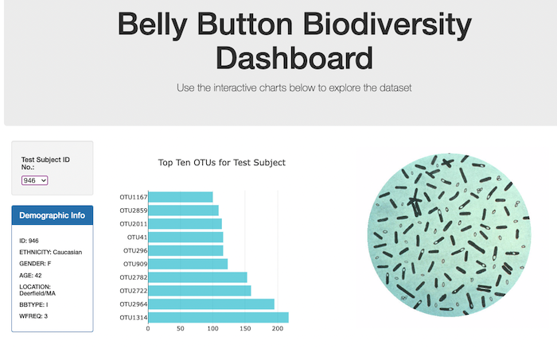

# Belly-Button-Biodiversity

In this project, I built an interactive dashboard to explore the Belly Button Biodiversity dataset, which catalogs the microbes that colonize human navels.

The dataset reveals that a small handful of microbial species (also called operational taxonomic units, or OTUs, in the study) were present in more than 70% of people, while the rest were relatively rare.

Using the D3 library, I created a horizontal bar chart with a dropdown menu to display the top 10 OTUs found for the chosen individual, along with a bubble chart that displays each sample. There is also a summary card that shows the individual's demographic information. Below are a couple of screenshots of the final page.

